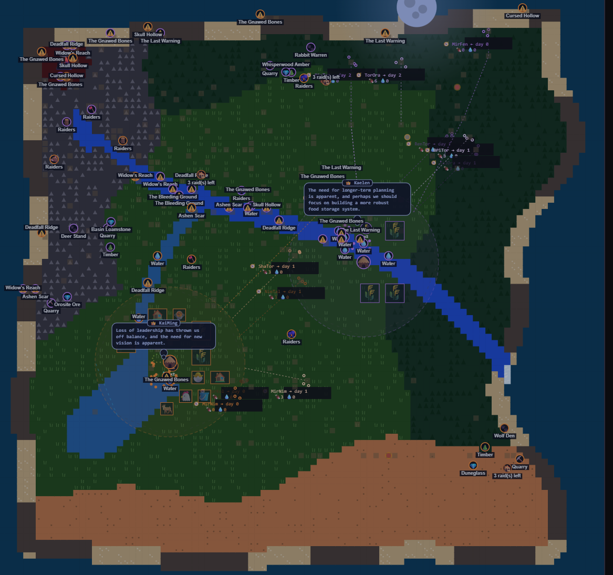

# Evolution2Civ (aka Project Chronos)

[](LICENSE)
[](https://github.com/ScottColeSW/Evo/releases/latest)

A local, spectator-mode sandbox where LLM-driven tribes (via [Ollama](https://ollama.com))
gather resources, invent their own language, and try to grow from a handful of survivors
into a founded, warring, or allying civilization — entirely on their own. You pick which
local model runs each tribe from a picker screen, hit start, and watch.

This started as a rambling voice-to-text brainstorm about factory patterns, multi-agent
adversarial games, and evolutionary civilization sims, then grew into a pitch deck framing
it as an "algorithmic survival environment" for stress-testing local models. It has since
grown well past that original pitch: a seven-era progression ladder, a five-tier Maslow
read on each tribe's condition, diplomacy that can genuinely backfire into war, conquest,
espionage, a genetics/breeding layer, and a headless benchmark harness for reproducible
model-vs-model comparison, on top of the original survival/exploration/language loop.



## What's actually happening

The short version: the LLM only ever *proposes* — it picks an allowed action, a target,
private rationale, and a broadcast in its own invented language. The simulation
deterministically validates and applies that choice; the world supplies scarcity, terrain,
hazards, progression, infrastructure, diplomacy, and consequences. The UI visualizes the
result in real time.

**For the full architecture — every module's responsibility, the era ladder, the
agent-decision contract, nudges vs. mechanical enforcement, diplomacy/conflict mechanics,
persistence, and known limits — see [`DESIGN.md`](DESIGN.md).** This README stays
deliberately short and operational; `DESIGN.md` is the maintained, as-built source of
truth for how the system actually works, so there's one place to keep current instead of
two documents quietly drifting apart.

## Multiple simulations at once

Each websocket connection owns its own `Simulation` (`backend/app.py`), so opening a
second browser tab starts a second, fully independent world rather than replacing the
first one's run. `run.py` also takes `--port` if you'd rather run fully separate OS
processes:

```bash
python run.py --port 8766
```

## Running it

Requires [Ollama](https://ollama.com) installed **and running** locally -- this app calls
its API at `http://localhost:11434` (`backend/config.py`'s `OLLAMA_URL`) both to list models
for the picker and for every tribe's turn. If Ollama isn't running, nothing crashes loudly:
the picker just shows **"(no models found)"** with a warning to pull a model, which is
misleading if the real problem is that Ollama itself isn't up yet.

Start (or confirm) the Ollama server first:

```bash
ollama serve
```

Leave that running in its own terminal/window. (On Windows/Mac, the Ollama app usually does
this automatically and keeps a tray/menu-bar icon running once you've launched it at least
once -- but it does *not* restart itself on its own after a reboot, so check for that icon,
or just run `ollama serve`, before assuming it's up.)

On Windows, to start it as a background process instead of dedicating a terminal window to
it, use PowerShell:

```powershell
Start-Process ollama -ArgumentList "serve" -WindowStyle Hidden
```

Stop it later with `Get-Process ollama | Stop-Process` if needed.

Confirm it's actually reachable:

```bash
ollama list
```

Then, in a separate terminal:

```bash
pip install -r requirements.txt
ollama pull gemma2:2b
ollama pull qwen2.5:3b
python run.py
```

Small, quantized models are the point, not an afterthought -- part of what this project
measures is exactly how (and whether) a small local model reasons under these constraints.
`gemma2:2b`, `qwen2.5:3b`, and `llama3.2` are the three this project's own benchmark trials
and A/B tests actually use; any Ollama model works, but a large one mostly just runs
slower without changing what's interesting about the result.

Then open `http://localhost:8765` in a browser, pick a model for each tribe, and press
**Begin Simulation**.

## Running tests

```bash
python -m pytest -q
```

No `pytest-asyncio` dependency — async tests use a small `asyncio.run()` wrapper
(`tests/conftest.py::run_async`) instead. Coverage is deliberately scoped to the
deterministic pieces (falloff math, decay, hazard rolls under a seeded RNG, scheduler
grouping, VRAM threshold logic, scoring formulas) — anything that requires a live Ollama
call is still verified by hand against the real server.

## Running the benchmark harness

`run_benchmark.py` drives the same `Simulation` headlessly — no browser, no websocket —
for reproducible model-vs-model comparison, and records raw facts (never a computed score)
into the long-running `logs/benchmark_results.db`:

```bash
python run_benchmark.py --scenario survival --models gemma2:2b --trials 3
python run_benchmark.py --scenario cooperation --models gemma2:2b,qwen2.5:3b
python run_benchmark.py --scenario war_ready_5000 --models gemma2:2b,llama3.2:latest --trials 1
python run_benchmark.py --report
python run_benchmark.py --report --scenario conflict
```

Progress prints every cycle while a trial runs (population/era/stance per tribe) --
useful given a real trial is genuine Ollama inference the whole way through, not
something that finishes instantly. `war_ready_5000` starts both tribes from a real,
curated late-game fixture (`backend/fixtures/`, ~population 5,000, Barracks and Battalion
already built) instead of the early-game grind, specifically to test what happens once
real war is actually reachable. See `backend/benchmark_scenarios.py` for the full scenario
list and `DESIGN.md` §4/§9 for how the harness fits into the rest of the system.

## Known limitations

See [`DESIGN.md` §11, "Known limits"](DESIGN.md#11-known-limits) for the current,
maintained list. Longer-running open design threads (world resource placement and
targeting intelligence, expedition scaling, small-model tiering, inter-chief negotiation)
live in this project's own memory notes rather than here, since they're proposals, not
as-built behavior.

## What's next

None of this is scheduled -- v1.0.0 is a real, clean stopping point, not a pause mid-thought.
Recorded here, with the reasoning, so anyone picking this up (including a later session)
understands why each one is still just an idea:

- **More than 4 tribes.** `MAX_TRIBES` is 4, and that's not an arbitrary ceiling to just
  raise -- `SPAWN_POINTS` has exactly 4 entries, the color palette and UI labeling assume
  that count for readability, and the resource-density/spawn-bias tuning was grounded
  against 2-tribe runs specifically. A real scaling pass touches spawn fairness and map
  legibility, not just a constant.
- **A map-reveal mechanic tied to the departure ending.** The more interesting of the two
  scaling ideas: `BUILD_VESSEL` ("Beyond the Horizon") currently lets a tribe leave the
  board outright, one-directional and terminal. Crowding near the map's edge could
  "bridge" into freshly-revealed territory instead -- one piece of design solving both the
  tribe-count ceiling and an ending that currently feels like just walking off, rather than
  two unrelated systems.
- **Hosted API models (OpenAI/Anthropic/etc.) alongside local Ollama.** Would broaden who
  can run this to people without strong local hardware, but it's a real tradeoff, not a free
  win: this project's whole thesis -- and what makes it interesting -- is specifically small
  local models reasoning under real constraints (the VRAM guard, model-swap-on-failure, the
  benchmark harness comparing local models against each other). Adding hosted providers is
  worth doing on purpose, as a mode alongside that story, not by default because it's easy.
- **Testing rigor for concurrent paths, specifically.** Two real bugs surfaced in one live
  session (`step()`'s stale-snapshot crash when a tribe was injected mid-cycle, and
  `add_tribe`'s id collision when two injections raced each other) were the same class of
  failure: shared state read once and trusted across an `await`, mutated concurrently by
  something else on the same event loop. If tribe count or model backends ever expand, that's
  where the real testing gap is -- concurrent/async paths specifically, not more coverage of
  the deterministic logic the suite already handles well.
